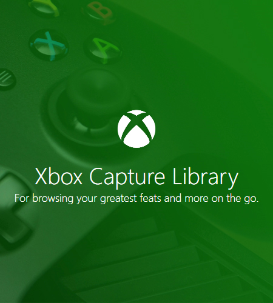

# Xbox Capture Library
A WPF Windows Application written in ASP.NET, which is purposed with pulling and displaying a user's videos/screenshots from Xbox Live using the "X" API service. Of the features implemented, all end users are granted the ability of:
* Filtering displayed captures by various search parameter metrics, including capture duration, like amount, view amount, etc.
* Displaying detailed statistics on a selected capture of choice (i.e. number of likes, the device on which the capture was taken, etc.).
* Downloading a capture in MP4 or PNG format respectively (depending on the capture type).
* Adjusting the application theme to more adequately compensate for light indifferences in the immediate vicinity.

## Getting Started
To successfully run the application, one will need posession of an "X" API account (for sake of acquiring an API key to access confidential user information), as well as an active Xbox Live profile which has capture data to draw from. 
For reference purposes, the sign up page for the "X" API service can be found as follows at the https://xapi.us/login domain.

> Once all neccesary resources have been gathered, the application setup wizard will then guide the user in the credential verification process, to which only valid strings will be accepted that abide by the defined ruleset.

## Technologies Used
- [MahApps.Metro](https://github.com/MahApps/MahApps.Metro) - a toolkit for creating metro-style WPF applications.
- [Newtonsoft.Json](https://github.com/JamesNK/Newtonsoft.Json) - a popular high-performance JSON framework for .NET.
- ["X" API](https://xapi.us/) - an unofficial API for retrieving Xbox Live data that is owned and maintained by FriendlyDev Limited.

## Contributors
| <a href="https://christianbedwell.github.io/" target="_blank">**ChristianBedwell**</a> | <a href="https://hbedwell24.github.io/" target="_blank">**HBedwell24**</a> |
|:---:|:---:|
|  | 
 |
| <a href="http://github.com/christianbedwell" target="_blank">`github.com/christianbedwell`</a> | <a href="http://github.com/hbedwell24" target="_blank">`github.com/hbedwell24`</a> |

## Gallery

## License

- **[MIT license](http://opensource.org/licenses/mit-license.php)**
- Copyright 2020 © <a href="https://github.com/HBedwell24" target="_blank">HBedwell24</a>.